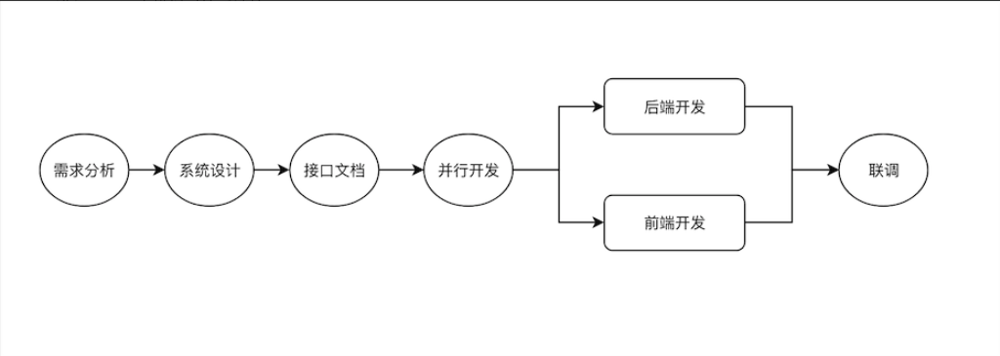
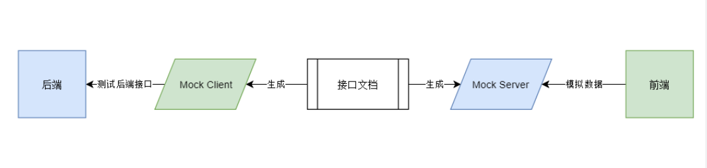

> [如果我是前端 Leader，怎么制定前端协作规范](https://juejin.im/post/5d3a7134f265da1b5d57f1ed)
> 来源：掘金  
> 作者：荒山

## 协作流程

1. 需求分析：参与这一般有前后端、PO，由 PO 主持，对需求进行宣贯，并接受开发人员的反馈，确保大家对需求有一定的认知。
2. 开发讨论：讨论应用的一些开发设计，沟通技术点、难点、以及分工问题。
3. 设计文档：可以由前后端一起设计；或者由后端设计、前端确认是否符合要求。
4. 并行开发：前后端并行开发。前端可以先实现静态页面，并根据接口文档对接口进行 `mock`, 来模拟对接后端接口。
5. 真实环境联调：前端将接口请求代理到后端服务，进行真实环境联调，并测试。

## API 规范

1. 选用接口标准：包括 `RESTful`、`GraphQL` 等。
2. 需要注意的点：
   - 明确区分 "正常" 与 "异常"，严格遵循接口的异常源语。
   - 明确数据类型：例如 单号 `ID` 等 的字段类型要明确 `String` 或 `Number` 。
   - 明确空值的意义：例如在做更新操作时，`null` 或 `空字符串` 是表示重置还是或略更新。
   - 接口版本化(暂时不考虑)

## 文档规范

1. RESTFul 接口可选择其他工具等实现 "代码及文档"（类似 `Graphql` 文档），避免人工维护接口文档导致代码及文档不同步问题，减少文档编写和维护的投入。
2. 人工维护推荐使用领域内 `YAPI` 文档工具，开通账号或权限等请联系 @刘晓钟 @韩贵和
3. API 文档中应包含以下信息：
   - 文档描述：该接口用于更新 xxx
   - 基本路径：`/update`
   - 请求方法：`POST`
   - 简单使用用例：可使用 `YAPI` 平台的 `mock` 服务，保证前后端可以并行开发。
   - 安全和认证（可选）：`token` 或 `cookie`
   - 具体接口定义：
     - 请求参数及其描述：必须说明类型（数据类型及是否可选等）
     - 响应参数及其描述：必须说明类型（数据类型及是否可选等）
     - 可能的异常情况：错误代码示例及描述

## 接口测试与模拟

1. 前端需要在联调之前使用 mock 服务搭建好静态页面。
2. 后端需要在联调钱测试接口是否可以正常工作。
3. 联调时需保证所有异常情况均可正常处理。

## 其他

1. RESTful 代码即文档工具：

   - [Swagger](https://swagger.io/)

2. 前端 mock 服务：YAPI 工具

   - [Mock.js](https://github.com/nuysoft/Mock)
